# Cobertura Visual Total — 2026-05-19T17-28-19

**Período:** 2026-05-19T17:31:17.562Z

## Resumo

| Métrica | Valor |
|---|---|
| Total telas testadas | 40 |
| ✅ OK (elementos visíveis) | 38 |
| ⚠️ Parcial (poucos elementos) | 2 |
| ❌ Erro | 0 |

## 📱 PACIENTE V3

### ✅ [P01] paciente-saude-home
- **URL:** `https://vitae-app.vercel.app/app-v3/app.html#saude`
- **Botões visíveis:** 33 · **Cards:** 0 · **Headings:** 1 · **Inputs:** 0
- 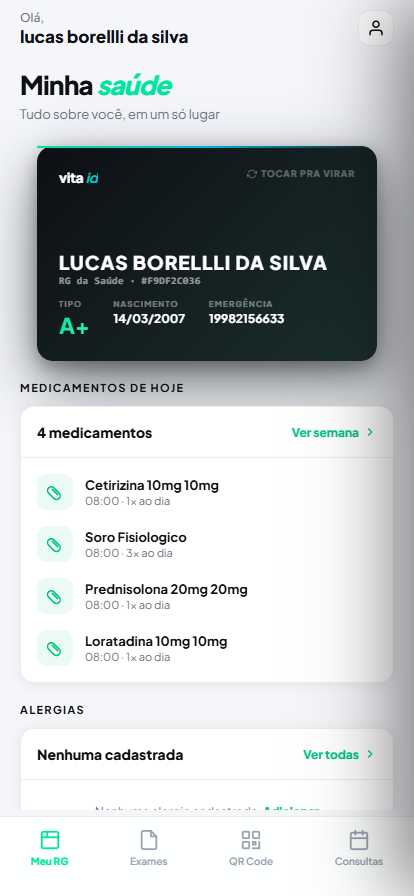
- **Preview:** `Mapa do app paciente  32 telas num arquivo único. Clique pra pular.  × ENTRADA + CADASTRO/LOGIN · 10 20 Splash 21 Boas-vindas 23 Login 24 Esqueci senha 25 Nova senha 26 Criar conta 27 Verificação SMS `

### ✅ [P02] paciente-exames
- **URL:** `https://vitae-app.vercel.app/app-v3/app.html#exames`
- **Botões visíveis:** 33 · **Cards:** 0 · **Headings:** 1 · **Inputs:** 0
- 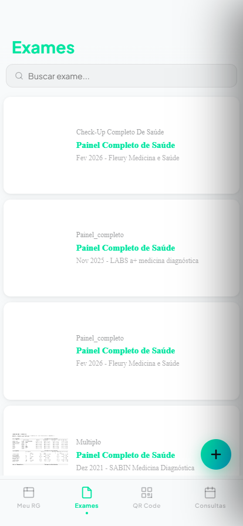
- **Preview:** `Mapa do app paciente  32 telas num arquivo único. Clique pra pular.  × ENTRADA + CADASTRO/LOGIN · 10 20 Splash 21 Boas-vindas 23 Login 24 Esqueci senha 25 Nova senha 26 Criar conta 27 Verificação SMS `

### ✅ [P03] paciente-qrcode
- **URL:** `https://vitae-app.vercel.app/app-v3/app.html#qr`
- **Botões visíveis:** 33 · **Cards:** 0 · **Headings:** 1 · **Inputs:** 0
- 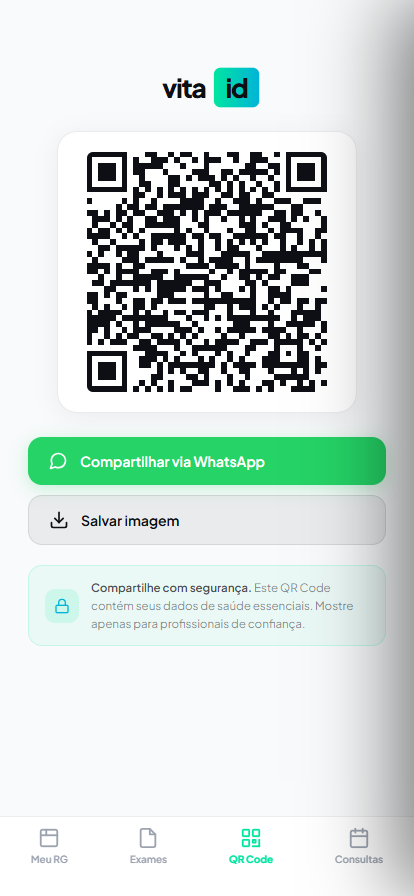
- **Preview:** `Mapa do app paciente  32 telas num arquivo único. Clique pra pular.  × ENTRADA + CADASTRO/LOGIN · 10 20 Splash 21 Boas-vindas 23 Login 24 Esqueci senha 25 Nova senha 26 Criar conta 27 Verificação SMS `

### ✅ [P04] paciente-consultas
- **URL:** `https://vitae-app.vercel.app/app-v3/app.html#consultas`
- **Botões visíveis:** 33 · **Cards:** 0 · **Headings:** 1 · **Inputs:** 0
- 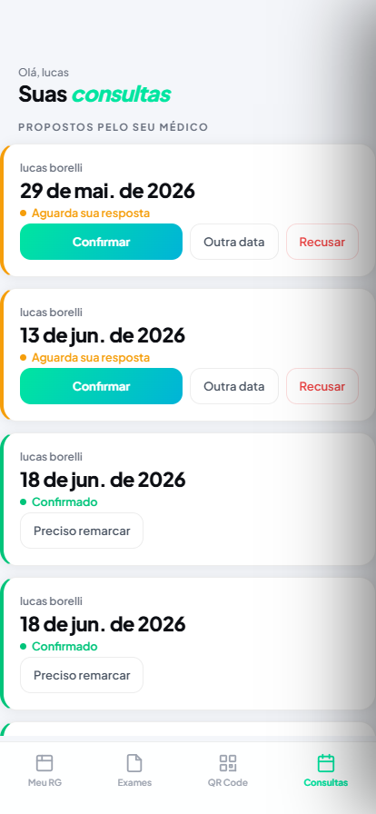
- **Preview:** `Mapa do app paciente  32 telas num arquivo único. Clique pra pular.  × ENTRADA + CADASTRO/LOGIN · 10 20 Splash 21 Boas-vindas 23 Login 24 Esqueci senha 25 Nova senha 26 Criar conta 27 Verificação SMS `

### ✅ [P05] paciente-perfil
- **URL:** `https://vitae-app.vercel.app/app-v3/app.html#perfil`
- **Botões visíveis:** 33 · **Cards:** 0 · **Headings:** 1 · **Inputs:** 0
- 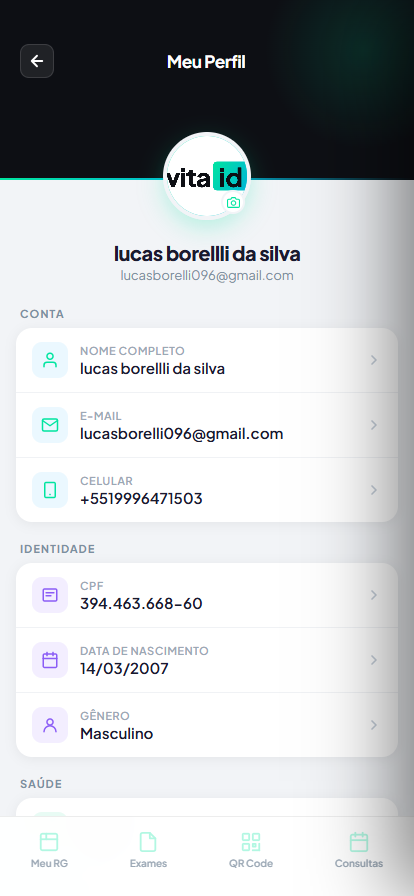
- **Preview:** `Mapa do app paciente  32 telas num arquivo único. Clique pra pular.  × ENTRADA + CADASTRO/LOGIN · 10 20 Splash 21 Boas-vindas 23 Login 24 Esqueci senha 25 Nova senha 26 Criar conta 27 Verificação SMS `

### ✅ [P06] paciente-15consultas-standalone
- **URL:** `https://vitae-app.vercel.app/app-v3/15-consultas.html`
- **Botões visíveis:** 31 · **Cards:** 16 · **Headings:** 0 · **Inputs:** 3
- 
- **Preview:** `Olá, lucas Suas consultas PROPOSTOS PELO SEU MÉDICO lucas borelli 29 de mai. de 2026 Aguarda sua resposta Confirmar Outra data Recusar lucas borelli 13 de jun. de 2026 Aguarda sua resposta Confirmar O`

### ⚠️ [P07] paciente-16-consulta-detalhe
- **URL:** `https://vitae-app.vercel.app/app-v3/16-consulta-detalhe.html`
- **Botões visíveis:** 0 · **Cards:** 0 · **Headings:** 0 · **Inputs:** 0
- 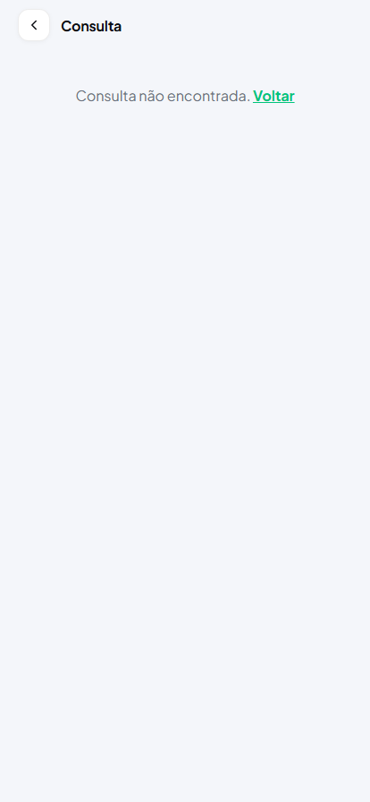
- **Preview:** `Consulta Consulta não encontrada. Voltar`

### ✅ [P08] paciente-exames-lista
- **URL:** `https://vitae-app.vercel.app/app-v3/09-exames-lista.html`
- **Botões visíveis:** 11 · **Cards:** 0 · **Headings:** 0 · **Inputs:** 1
- 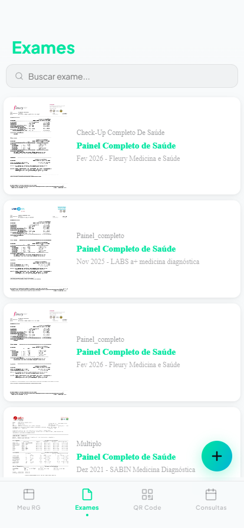
- **Preview:** `Exames Check-Up Completo De Saúde Painel Completo de Saúde Fev 2026 - Fleury Medicina e Saúde Painel_completo Painel Completo de Saúde Nov 2025 - LABS a+ medicina diagnóstica Painel_completo Painel Co`

### ✅ [P09] paciente-exame-detalhe
- **URL:** `https://vitae-app.vercel.app/app-v3/10-exame-detalhe.html`
- **Botões visíveis:** 3 · **Cards:** 0 · **Headings:** 0 · **Inputs:** 0
- 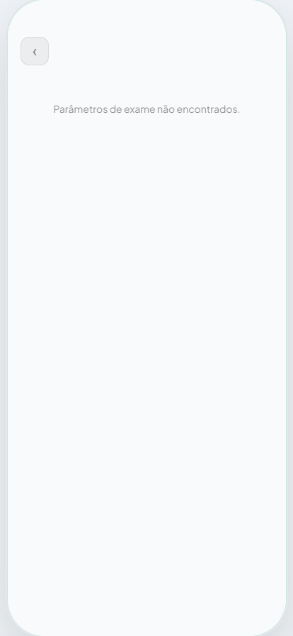
- **Preview:** `‹ Parâmetros de exame não encontrados. ‹ ‹`

### ✅ [P10] paciente-qr-standalone
- **URL:** `https://vitae-app.vercel.app/app-v3/12-qr-code.html`
- **Botões visíveis:** 2 · **Cards:** 1 · **Headings:** 0 · **Inputs:** 0
- 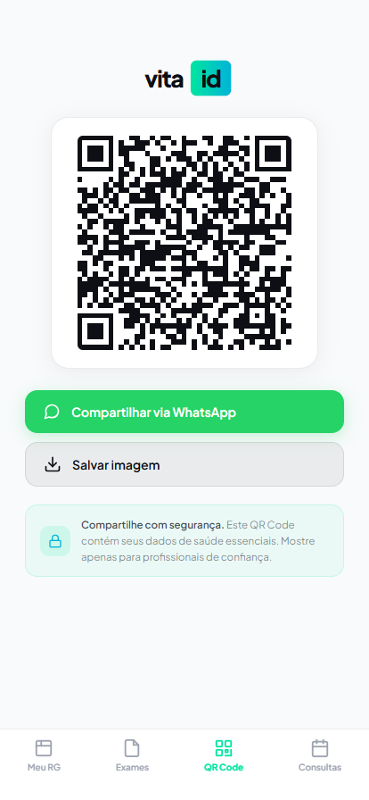
- **Preview:** `vita id Compartilhar via WhatsApp Salvar imagem Compartilhe com segurança. Este QR Code contém seus dados de saúde essenciais. Mostre apenas para profissionais de confiança. Meu RG Exames QR Code Cons`

### ✅ [P11] paciente-18-perfil
- **URL:** `https://vitae-app.vercel.app/app-v3/18-perfil.html`
- **Botões visíveis:** 3 · **Cards:** 5 · **Headings:** 1 · **Inputs:** 0
- 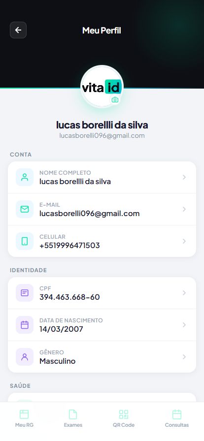
- **Preview:** `Meu Perfil lucas borellli da silva  lucasborelli096@gmail.com  CONTA NOME COMPLETO lucas borellli da silva E-MAIL lucasborelli096@gmail.com CELULAR +5519996471503 IDENTIDADE CPF 394.463.668-60 DATA DE`

### ✅ [P12] paciente-medicamentos
- **URL:** `https://vitae-app.vercel.app/app-v3/03-medicamentos.html`
- **Botões visíveis:** 1 · **Cards:** 3 · **Headings:** 1 · **Inputs:** 1
- 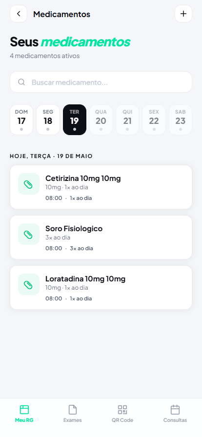
- **Preview:** `Medicamentos Seus medicamentos 4 medicamentos ativos DOM 17 SEG 18 TER 19 QUA 20 QUI 21 SEX 22 SAB 23 HOJE, TERÇA · 19 DE MAIO Cetirizina 10mg 10mg 10mg · 1x ao dia 08:00 · 1x ao dia Soro Fisiologico `

### ✅ [P13] paciente-medicamento-detalhe
- **URL:** `https://vitae-app.vercel.app/app-v3/04-med-detalhe.html`
- **Botões visíveis:** 1 · **Cards:** 0 · **Headings:** 0 · **Inputs:** 0
- 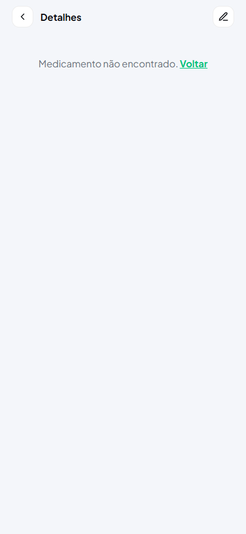
- **Preview:** `Detalhes Medicamento não encontrado. Voltar`

### ✅ [P14] paciente-add-medicamento
- **URL:** `https://vitae-app.vercel.app/app-v3/05-add-medicamento.html`
- **Botões visíveis:** 1 · **Cards:** 0 · **Headings:** 1 · **Inputs:** 8
- 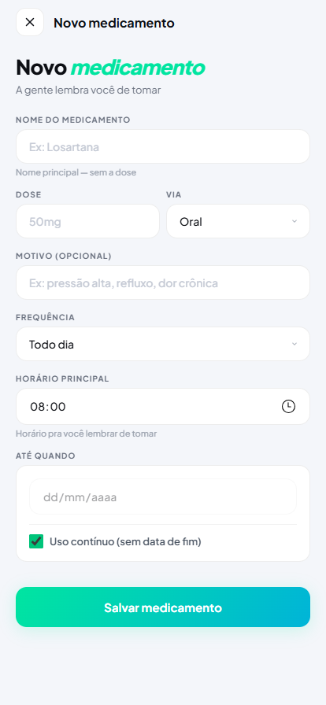
- **Preview:** `Novo medicamento Novo medicamento A gente lembra você de tomar NOME DO MEDICAMENTO Nome principal — sem a dose DOSE VIA Oral Sublingual Tópico Injetável Inalatório MOTIVO (OPCIONAL) FREQUÊNCIA Todo di`

### ✅ [P15] paciente-alergias
- **URL:** `https://vitae-app.vercel.app/app-v3/06-alergias.html`
- **Botões visíveis:** 2 · **Cards:** 1 · **Headings:** 1 · **Inputs:** 0
- 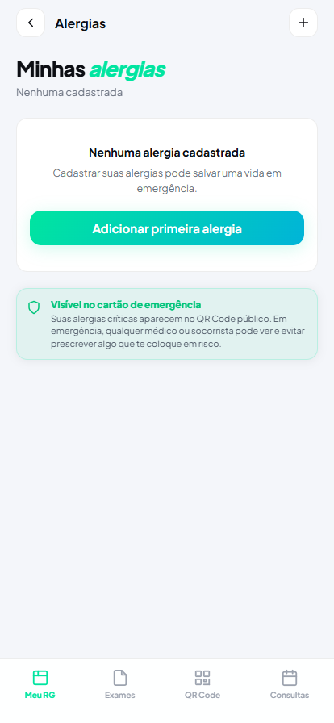
- **Preview:** `Alergias Minhas alergias Nenhuma cadastrada Nenhuma alergia cadastrada Cadastrar suas alergias pode salvar uma vida em emergência. Adicionar primeira alergia Visível no cartão de emergência Suas alerg`

### ⚠️ [P16] paciente-alergia-detalhe
- **URL:** `https://vitae-app.vercel.app/app-v3/07-alergia-detalhe.html`
- **Botões visíveis:** 0 · **Cards:** 0 · **Headings:** 0 · **Inputs:** 0
- 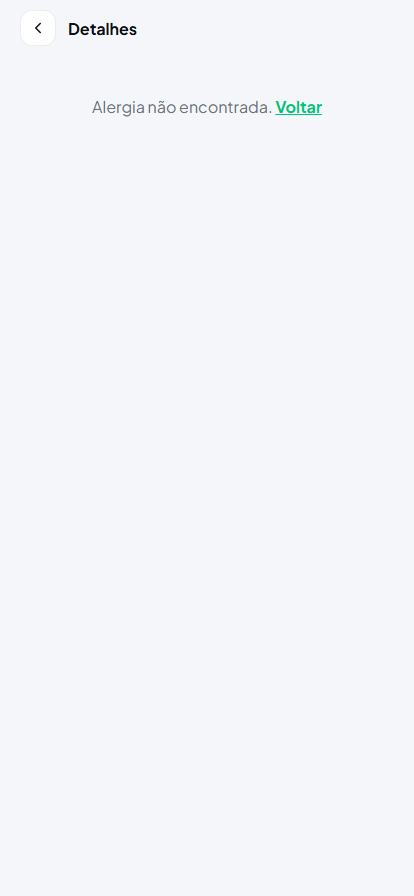
- **Preview:** `Detalhes Alergia não encontrada. Voltar`

### ✅ [P17] paciente-add-alergia
- **URL:** `https://vitae-app.vercel.app/app-v3/08-add-alergia.html`
- **Botões visíveis:** 1 · **Cards:** 0 · **Headings:** 1 · **Inputs:** 2
- 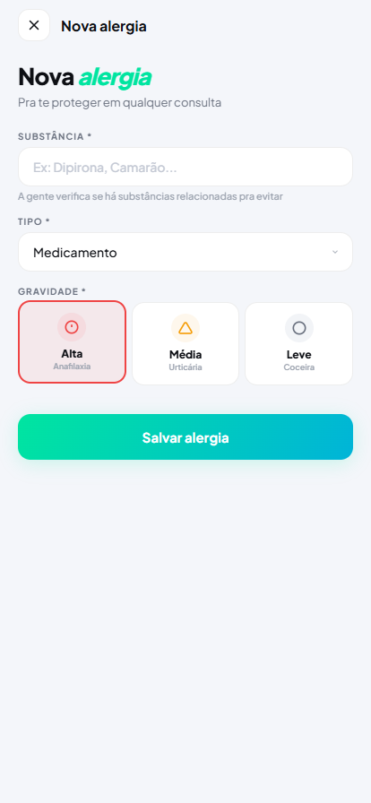
- **Preview:** `Nova alergia Nova alergia Pra te proteger em qualquer consulta SUBSTÂNCIA * A gente verifica se há substâncias relacionadas pra evitar TIPO * Medicamento Alimento Contato (látex, metal, tecido…) Ambie`

### ✅ [P18] paciente-privacidade
- **URL:** `https://vitae-app.vercel.app/app-v3/71-privacidade.html`
- **Botões visíveis:** 3 · **Cards:** 1 · **Headings:** 0 · **Inputs:** 2
- 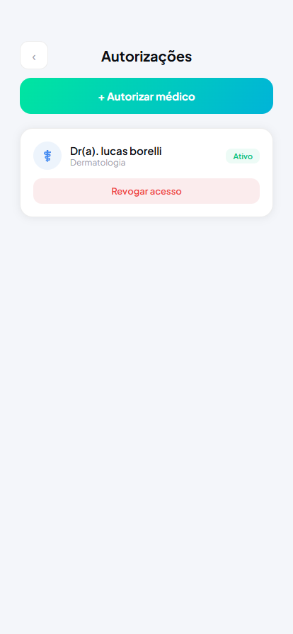
- **Preview:** `‹ Autorizações + Autorizar médico ⚕️ Dr(a). lucas borelli Dermatologia Ativo Revogar acesso Autorizar Médico CRM DO MÉDICO DURAÇÃO (DIAS) Autorizar acesso`

### ✅ [P19] paciente-saude-standalone
- **URL:** `https://vitae-app.vercel.app/app-v3/01-saude.html`
- **Botões visíveis:** 1 · **Cards:** 23 · **Headings:** 1 · **Inputs:** 0
- 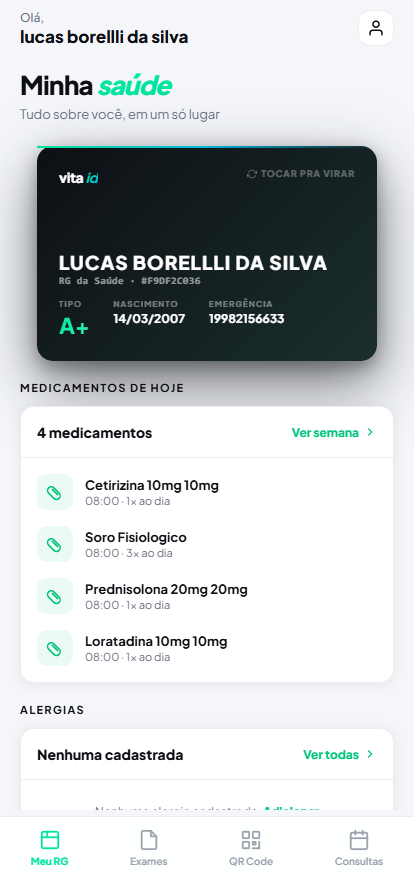
- **Preview:** `Olá, lucas borellli da silva Minha saúde Tudo sobre você, em um só lugar vita id TOCAR PRA VIRAR LUCAS BORELLLI DA SILVA RG da Saúde · #F9DF2C036 TIPO A+ NASCIMENTO 14/03/2007 EMERGÊNCIA 19982156633 v`

### ✅ [P20] paciente-preconsulta-sem-token
- **URL:** `https://vitae-app.vercel.app/app-v3/pre-consulta.html`
- **Botões visíveis:** 1 · **Cards:** 0 · **Headings:** 0 · **Inputs:** 0
- 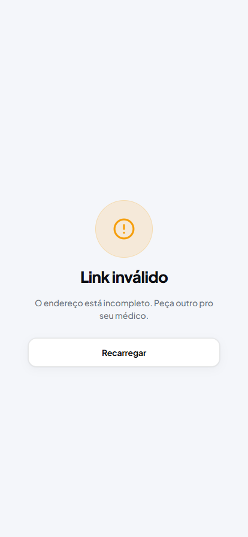
- **Preview:** `Link inválido O endereço está incompleto. Peça outro pro seu médico. Recarregar`

### ✅ [P21] paciente-preconsulta-token-invalido
- **URL:** `vitae-app.vercel.app/app-v3/pre-consulta.html?token=INVALIDO-2026-05-19T17-28-19`
- **Botões visíveis:** 1 · **Cards:** 0 · **Headings:** 0 · **Inputs:** 0
- 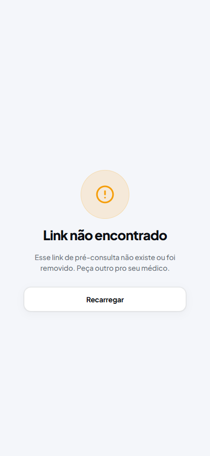
- **Preview:** `Link não encontrado Esse link de pré-consulta não existe ou foi removido. Peça outro pro seu médico. Recarregar`

### ✅ [P22] paciente-apos-clicar-card
- **URL:** `https://vitae-app.vercel.app/app-v3/15-consultas.html`
- **Botões visíveis:** 31 · **Cards:** 16 · **Headings:** 0 · **Inputs:** 3
- 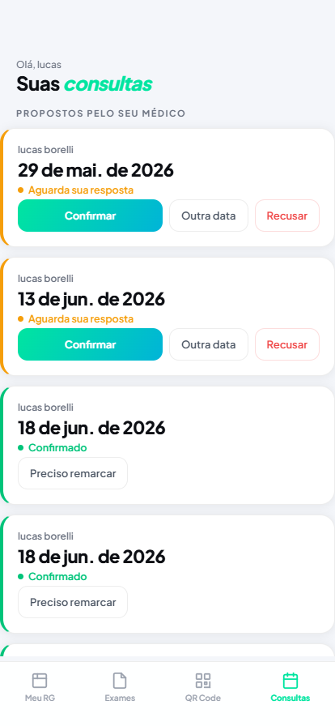
- **Preview:** `Olá, lucas Suas consultas PROPOSTOS PELO SEU MÉDICO lucas borelli 29 de mai. de 2026 Aguarda sua resposta Confirmar Outra data Recusar lucas borelli 13 de jun. de 2026 Aguarda sua resposta Confirmar O`

## 💻 MÉDICO DESKTOP

### ✅ [M01] medico-aba-hoje
- **URL:** `https://vitae-app.vercel.app/desktop/app-v2.html`
- **Botões:** 4 · **Cards:** 5 · **Headings:** 0 · **Inputs:** 0
- 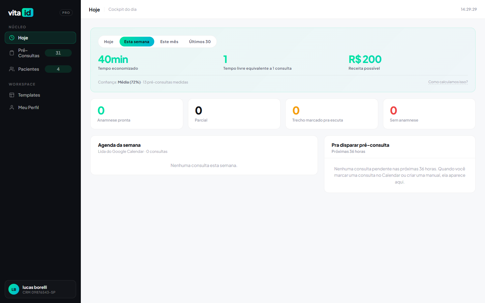
- **Preview:** `vita id PRO NÚCLEO Hoje Pré-Consultas 31 Pacientes 4 WORKSPACE Templates Meu Perfil LB lucas borelli CRM 09876543-SP Hoje Cockpit do dia 14:29:29 Hoje Esta semana Este mês Últimos 30 40min Tempo econo`

### ✅ [M02] medico-aba-pre-consultas
- **URL:** `https://vitae-app.vercel.app/desktop/app-v2.html`
- **Botões:** 65 · **Cards:** 1 · **Headings:** 1 · **Inputs:** 1
- 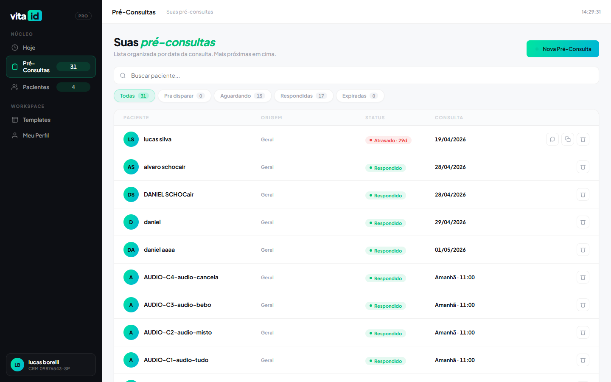
- **Preview:** `vita id PRO NÚCLEO Hoje Pré-Consultas 31 Pacientes 4 WORKSPACE Templates Meu Perfil LB lucas borelli CRM 09876543-SP Pré-Consultas Suas pré-consultas 14:29:31 Suas pré-consultas  Lista organizada por `

### ✅ [M03] medico-aba-pacientes-lista
- **URL:** `https://vitae-app.vercel.app/desktop/app-v2.html`
- **Botões:** 3 · **Cards:** 1 · **Headings:** 1 · **Inputs:** 1
- 
- **Preview:** `vita id PRO NÚCLEO Hoje Pré-Consultas 31 Pacientes 4 WORKSPACE Templates Meu Perfil LB lucas borelli CRM 09876543-SP Pacientes Seus pacientes 14:29:34 Seus pacientes  4 que já responderam · 18 pré-con`

### ✅ [M04] medico-paciente-detalhe-clicado
- **URL:** `https://vitae-app.vercel.app/desktop/app-v2.html`
- **Botões:** 13 · **Cards:** 4 · **Headings:** 0 · **Inputs:** 3
- 
- **Preview:** `vita id PRO NÚCLEO Hoje Pré-Consultas 31 Pacientes 4 WORKSPACE Templates Meu Perfil LB lucas borelli CRM 09876543-SP Pacientes Histórico de anamneses 14:29:39 Pacientes ROBO-MASTER-19MAI A.8 bebo 19 a`

### ✅ [M05] medico-briefing-1minuto
- **URL:** `https://vitae-app.vercel.app/desktop/app-v2.html`
- **Botões:** 13 · **Cards:** 4 · **Headings:** 0 · **Inputs:** 3
- 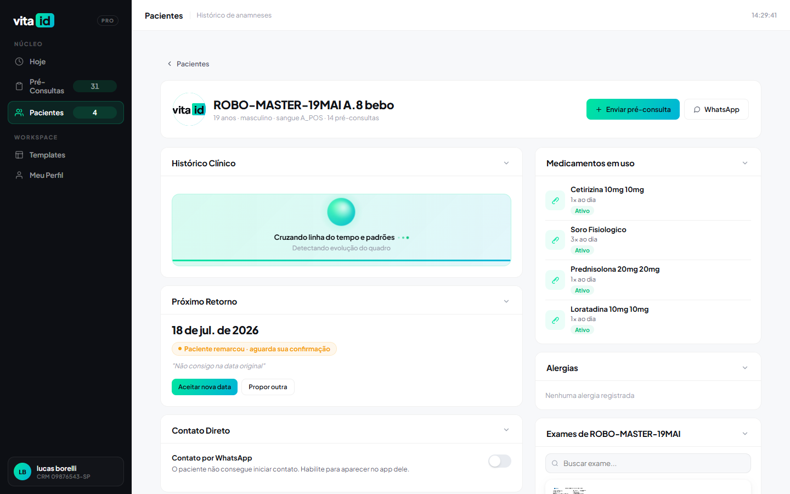
- **Preview:** `vita id PRO NÚCLEO Hoje Pré-Consultas 31 Pacientes 4 WORKSPACE Templates Meu Perfil LB lucas borelli CRM 09876543-SP Pacientes Histórico de anamneses 14:29:42 Pacientes ROBO-MASTER-19MAI A.8 bebo 19 a`

### ✅ [M06] medico-aba-templates
- **URL:** `https://vitae-app.vercel.app/desktop/app-v2.html`
- **Botões:** 13 · **Cards:** 2 · **Headings:** 1 · **Inputs:** 1
- 
- **Preview:** `O que é um template? Um conjunto de perguntas personalizado para enviar ao paciente antes da consulta. Você cria uma vez e reutiliza sempre. Próximo Pular introdução vita id PRO NÚCLEO Hoje Pré-Consul`

### ✅ [M07] medico-aba-perfil
- **URL:** `https://vitae-app.vercel.app/desktop/app-v2.html`
- **Botões:** 2 · **Cards:** 0 · **Headings:** 1 · **Inputs:** 0
- 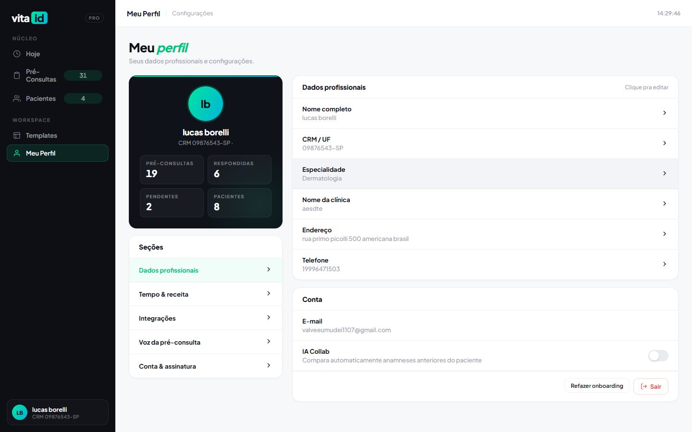
- **Preview:** `vita id PRO NÚCLEO Hoje Pré-Consultas 31 Pacientes 4 WORKSPACE Templates Meu Perfil LB lucas borelli CRM 09876543-SP Meu Perfil Configurações 14:29:46 Meu perfil  Seus dados profissionais e configuraç`

### ✅ [M08] perfil-dados
- **URL:** `https://vitae-app.vercel.app/desktop/app-v2.html`
- **Botões:** 2 · **Cards:** 0 · **Headings:** 1 · **Inputs:** 0
- 
- **Preview:** `vita id PRO NÚCLEO Hoje Pré-Consultas 31 Pacientes 4 WORKSPACE Templates Meu Perfil LB lucas borelli CRM 09876543-SP Meu Perfil Configurações 14:29:54 Meu perfil  Seus dados profissionais e configuraç`

### ✅ [M09] perfil-tempo-receita
- **URL:** `https://vitae-app.vercel.app/desktop/app-v2.html`
- **Botões:** 2 · **Cards:** 0 · **Headings:** 1 · **Inputs:** 0
- 
- **Preview:** `vita id PRO NÚCLEO Hoje Pré-Consultas 31 Pacientes 4 WORKSPACE Templates Meu Perfil LB lucas borelli CRM 09876543-SP Meu Perfil Configurações 14:30:01 Meu perfil  Seus dados profissionais e configuraç`

### ✅ [M10] perfil-integracoes
- **URL:** `https://vitae-app.vercel.app/desktop/app-v2.html`
- **Botões:** 2 · **Cards:** 0 · **Headings:** 1 · **Inputs:** 0
- 
- **Preview:** `vita id PRO NÚCLEO Hoje Pré-Consultas 31 Pacientes 4 WORKSPACE Templates Meu Perfil LB lucas borelli CRM 09876543-SP Meu Perfil Configurações 14:30:09 Meu perfil  Seus dados profissionais e configuraç`

### ✅ [M11] perfil-voz
- **URL:** `https://vitae-app.vercel.app/desktop/app-v2.html`
- **Botões:** 2 · **Cards:** 0 · **Headings:** 1 · **Inputs:** 0
- 
- **Preview:** `vita id PRO NÚCLEO Hoje Pré-Consultas 31 Pacientes 4 WORKSPACE Templates Meu Perfil LB lucas borelli CRM 09876543-SP Meu Perfil Configurações 14:30:16 Meu perfil  Seus dados profissionais e configuraç`

### ✅ [M12] perfil-conta
- **URL:** `https://vitae-app.vercel.app/desktop/app-v2.html`
- **Botões:** 2 · **Cards:** 0 · **Headings:** 1 · **Inputs:** 0
- 
- **Preview:** `vita id PRO NÚCLEO Hoje Pré-Consultas 31 Pacientes 4 WORKSPACE Templates Meu Perfil LB lucas borelli CRM 09876543-SP Meu Perfil Configurações 14:30:23 Meu perfil  Seus dados profissionais e configuraç`

### ✅ [M13] medico-pc-sumario
- **URL:** `https://vitae-app.vercel.app/desktop/app-v2.html`
- **Botões:** 65 · **Cards:** 1 · **Headings:** 1 · **Inputs:** 1
- 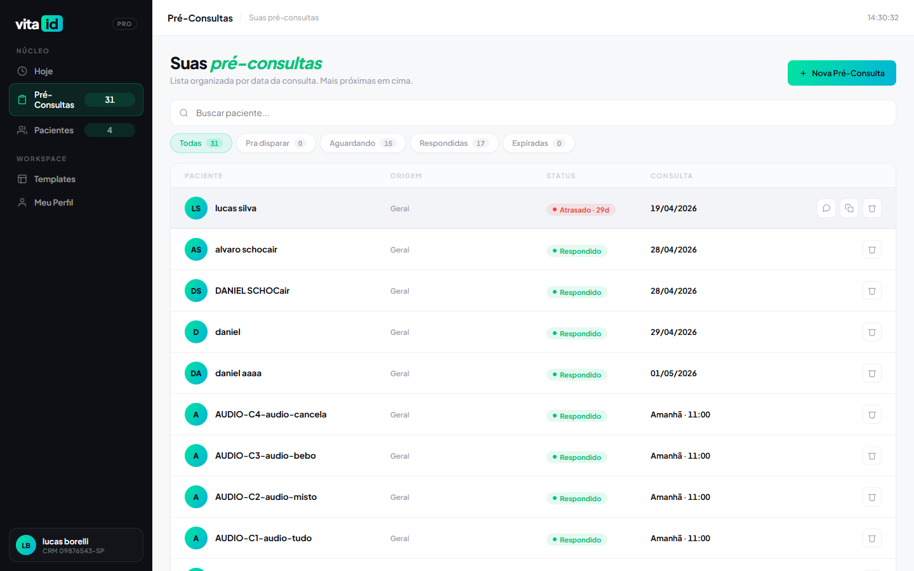
- **Preview:** `vita id PRO NÚCLEO Hoje Pré-Consultas 31 Pacientes 4 WORKSPACE Templates Meu Perfil LB lucas borelli CRM 09876543-SP Pré-Consultas Suas pré-consultas 14:30:33 Suas pré-consultas  Lista organizada por `

### ✅ [M14] medico-criar-pc-nao-abriu
- **URL:** `https://vitae-app.vercel.app/desktop/app-v2.html`
- **Botões:** 3 · **Cards:** 1 · **Headings:** 1 · **Inputs:** 1
- 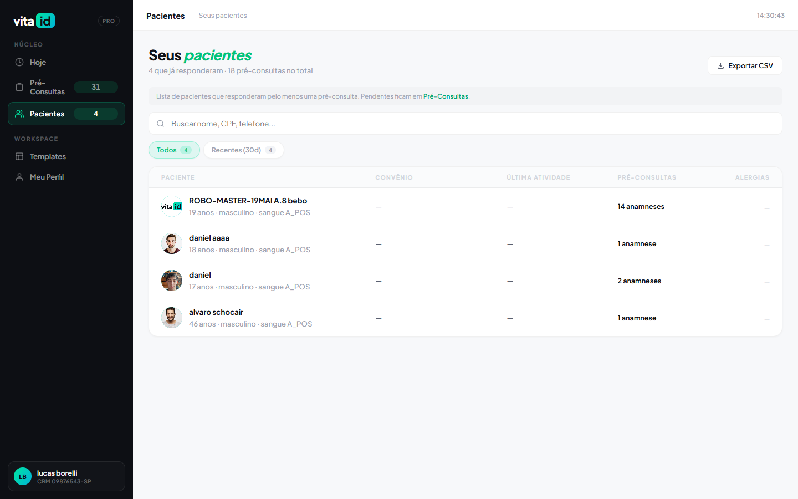
- **Preview:** `vita id PRO NÚCLEO Hoje Pré-Consultas 31 Pacientes 4 WORKSPACE Templates Meu Perfil LB lucas borelli CRM 09876543-SP Pacientes Seus pacientes 14:30:45 Seus pacientes  4 que já responderam · 18 pré-con`

### ✅ [M15] medico-como-funciona-templates
- **URL:** `https://vitae-app.vercel.app/desktop/app-v2.html`
- **Botões:** 13 · **Cards:** 2 · **Headings:** 1 · **Inputs:** 1
- 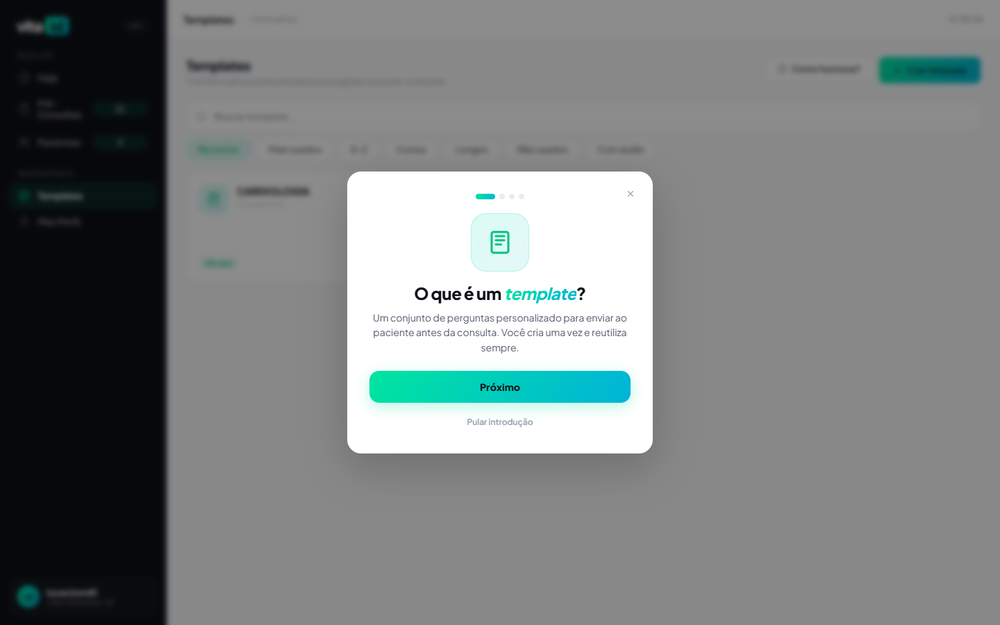
- **Preview:** `O que é um template? Um conjunto de perguntas personalizado para enviar ao paciente antes da consulta. Você cria uma vez e reutiliza sempre. Próximo Pular introdução vita id PRO NÚCLEO Hoje Pré-Consul`

### ✅ [M16] medico-criar-template-passo1
- **URL:** `https://vitae-app.vercel.app/desktop/app-v2.html`
- **Botões:** 4 · **Cards:** 1 · **Headings:** 2 · **Inputs:** 1
- 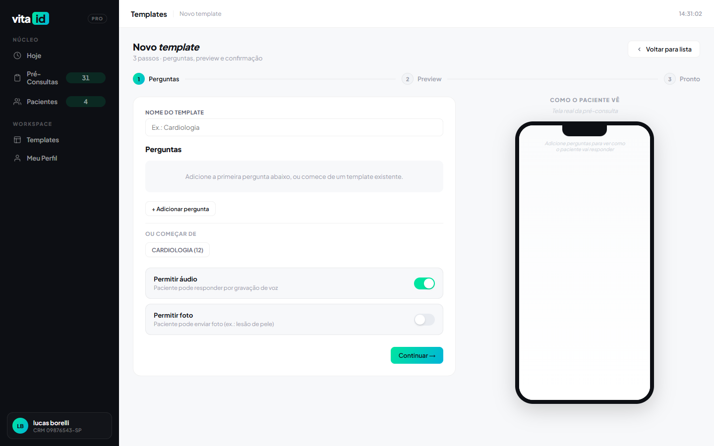
- **Preview:** `vita id PRO NÚCLEO Hoje Pré-Consultas 31 Pacientes 4 WORKSPACE Templates Meu Perfil LB lucas borelli CRM 09876543-SP Templates Novo template 14:31:03 Novo template  3 passos · perguntas, preview e con`

### ✅ [M17] medico-modal-logout
- **URL:** `https://vitae-app.vercel.app/desktop/app-v2.html`
- **Botões:** 7 · **Cards:** 5 · **Headings:** 0 · **Inputs:** 0
- 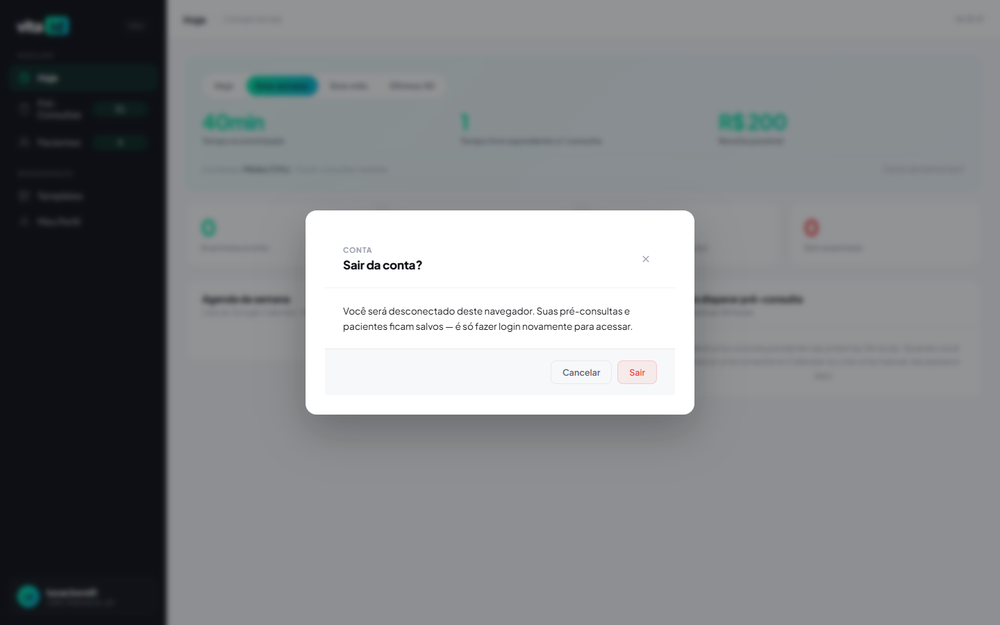
- **Preview:** `vita id PRO NÚCLEO Hoje Pré-Consultas 31 Pacientes 4 WORKSPACE Templates Meu Perfil LB lucas borelli CRM 09876543-SP Hoje Cockpit do dia 14:31:12 Hoje Esta semana Este mês Últimos 30 40min Tempo econo`

### ✅ [M18] medico-sem-auth-redireciona
- **URL:** `https://vitae-app.vercel.app/desktop/app-v2.html`
- **Botões:** 4 · **Cards:** 5 · **Headings:** 0 · **Inputs:** 0
- 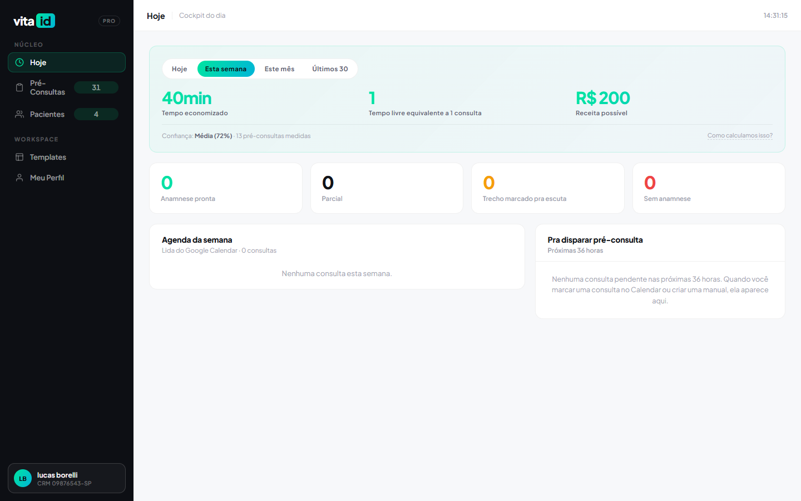
- **Preview:** `vita id PRO NÚCLEO Hoje Pré-Consultas 31 Pacientes 4 WORKSPACE Templates Meu Perfil LB lucas borelli CRM 09876543-SP Hoje Cockpit do dia 14:31:16 Hoje Esta semana Este mês Últimos 30 40min Tempo econo`

